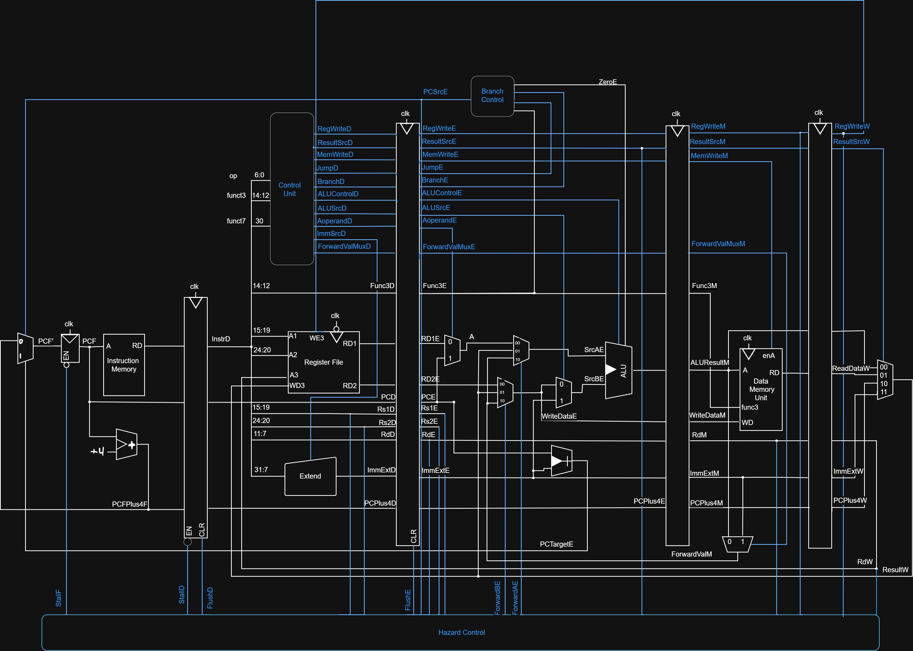
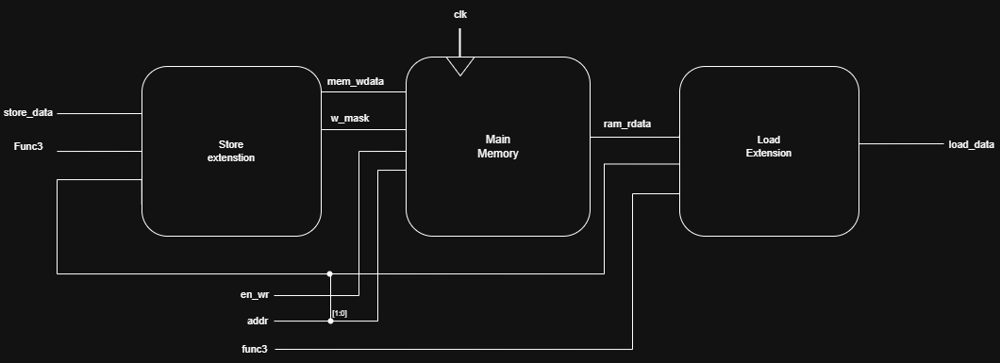
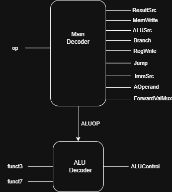
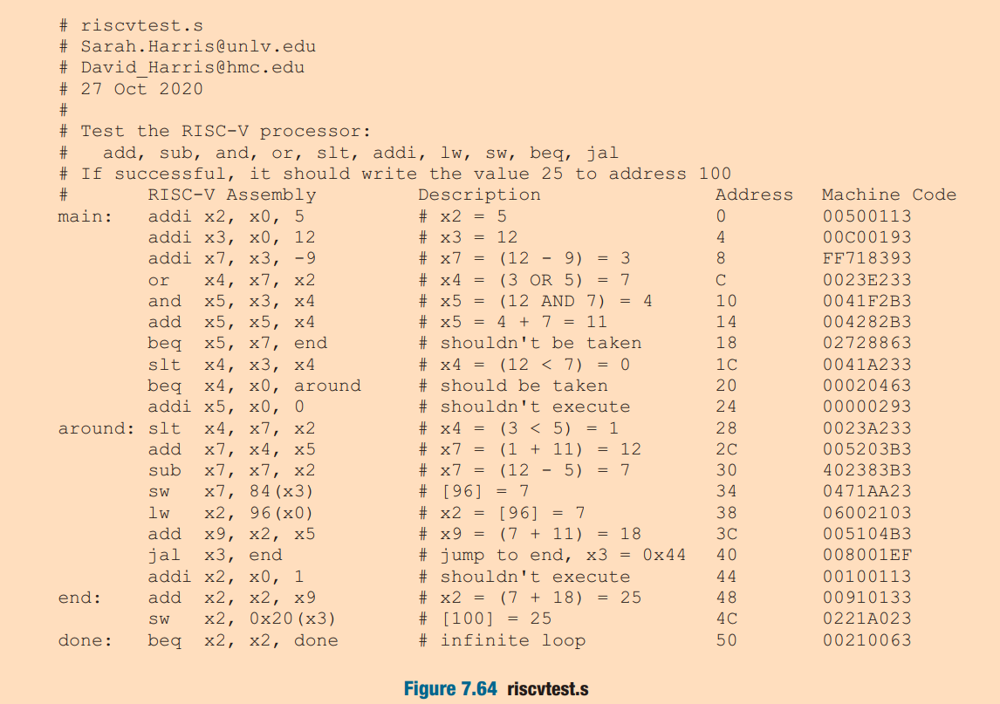
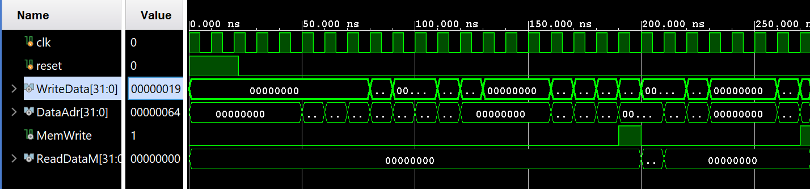
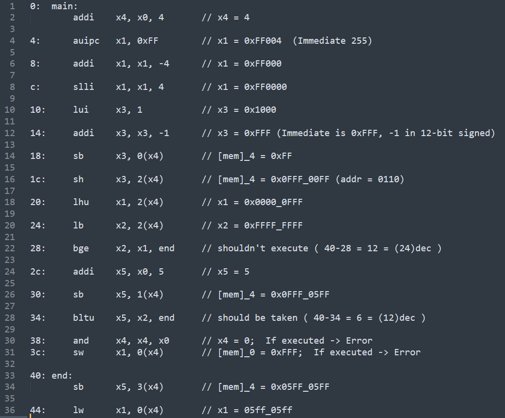
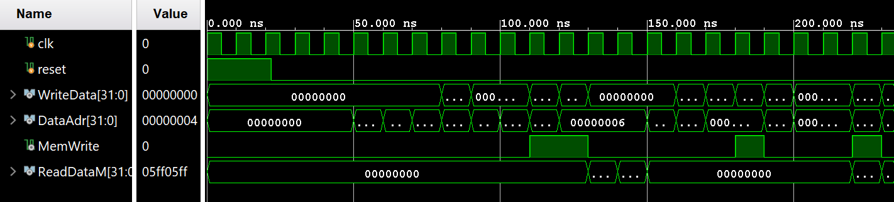

RV32I Pipelined Processor (Harvard Architecture)

## Overview:
This repository contains the RTL design and verification environment for a 32-bit RISC-V processor implementing the **RV32I Base Integer Instruction Set**. 

The core is designed using a **5-stage pipeline** approach and utilizes a **Harvard Architecture**, physically separating Instruction Memory and Data Memory for simultaneous access. This project was developed to explore computer architecture fundamentals, specifically pipeline hazard management and data forwarding techniques.

## ⚙️ Key Features
* **ISA:** RISC-V 32-bit Integer (RV32I).
* **Architecture:** Harvard (Separate Instruction and Data buses).
* **Pipeline Depth:** 5 Stages (Fetch, Decode, Execute, Memory, Writeback).
* **Hazard Handling:**
 * **Data Hazards:** Solved via a dedicated Forwarding Unit (EX-to-EX and MEM-to-EX).
 * **Control Hazards:** Handled via Branch Prediction (Static/Not Taken) and pipeline flushing.
 * **Load-Use Hazards:** Handled via a Hazard Detection Unit (Stalling).
* **Language:** Verilog HDL.

## 🏗️ Architecture Design
The processor follows the classic 5-stage pipeline model. Below is the high-level block diagram of the datapath and control units.

Proccesor:

Memory Unit:

Control Unit:  
  

## Pipeline Stages
1.  **Instruction Fetch (IF):** Fetches instruction from IMEM using PC.
2.  **Instruction Decode (ID):** Decodes instruction and reads register file (RegFile).
3.  **Execute (EX):** ALU operations, branch outcome calculation, and address generation.
4.  **Memory Access (MEM):** Reads/Writes to Data Memory.
5.  **Writeback (WB):** Writes results back to the Register File.

## Waveform Results
Below is a waveform result and the assembly code executed:

**Test1**:

assembly code of test 1:

wave simulation of test 1:

**Test 2**:  
assembly code of test 2:  

wave simulation of test 2:

## Credits:
Digital Design and Computer Architecture, RISC-V Edition
https://www.amazon.com/Digital-Design-Computer-Architecture-RISC-V/dp/0128200642
